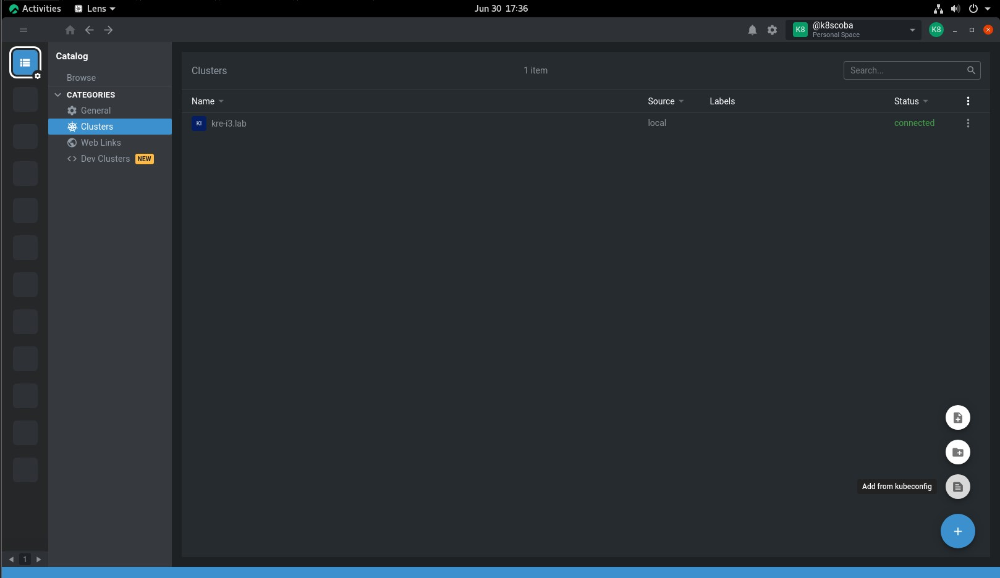
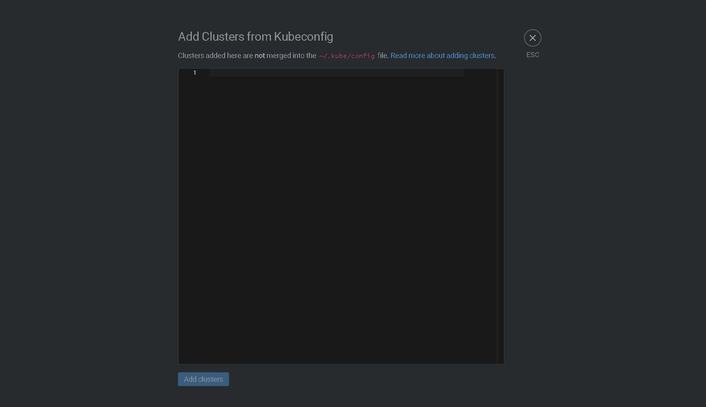
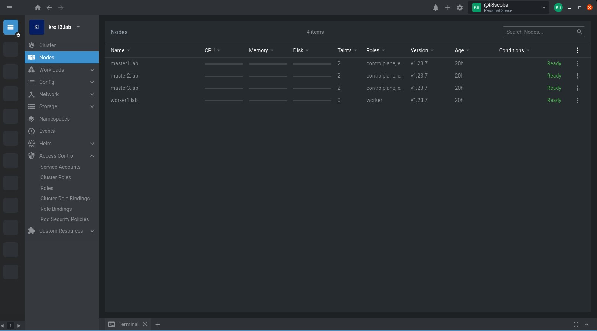

Lab System Requirements :
- 3 VM node Master (@vCPU 2 core; @Memory 8 GB; @Disk 40 GB) ==> 192.168.0.119 - 192.168.0.121
- 1 VM node Worker (@vCPU 2 core; @Memory 3 GB; @Disk 40 GB) ==> 192.168.0.122
- 1 VM node workstation (@vCPU 2 core; @Memory 3 GB; @Disk 40 GB) ==> 192.168.0.118


Node master and worker using Rocky Linux 8.5 Minimal except VM workstation using Rocky Linux GUI

* PS ==>  All node = 3 VM Master + 1 VM Worker + 1 VM Workstation, the lab not recommend for production env :D

1. Setup docker repo on all nodes:
```
yum install -y yum-utils
yum-config-manager --add-repo https://download.docker.com/linux/centos/docker-ce.repo
```

2. List all of repo 
```
[root@rke ~]# yum repolist
repo id                             repo name
appstream                           Rocky Linux 8 - AppStream
baseos                              Rocky Linux 8 - BaseOS
docker-ce-stable                    Docker CE Stable - x86_64
extras                              Rocky Linux 8 - Extras
```

3. Install yum-utils runc :
```
yum -y install  yum-utils runc 
```

4. Install Docker
```
yum -y install docker-ce docker-ce-cli containerd.io
```

5. Create syslimk and enable the svc of docker on all node
```
newgrp docker
usermod -aG docker root
systemctl enable  docker --now
```


6. Check the docker version
```
[root@rke ~]# docker version
Client: Docker Engine - Community
 Version:           20.10.17
 API version:       1.41
 Go version:        go1.17.11
 Git commit:        100c701
 Built:             Mon Jun  6 23:03:11 2022
 OS/Arch:           linux/amd64
 Context:           default
 Experimental:      true

Server: Docker Engine - Community
 Engine:
  Version:          20.10.17
  API version:      1.41 (minimum version 1.12)
  Go version:       go1.17.11
  Git commit:       a89b842
  Built:            Mon Jun  6 23:01:29 2022
  OS/Arch:          linux/amd64
  Experimental:     false
 containerd:
  Version:          1.6.6
  GitCommit:        10c12954828e7c7c9b6e0ea9b0c02b01407d3ae1
 runc:
  Version:          1.1.2
  GitCommit:        v1.1.2-0-ga916309
 docker-init:
  Version:          0.19.0
  GitCommit:        de40ad0
```

7. Disables SELinux on all node:

```
setenforce 0  
sed -i 's/^SELINUX=enforcing$/SELINUX=permissive/' /etc/selinux/config
```


8. Download the latest RKE https://github.com/rancher/rke/
```
wget https://github.com/rancher/rke/releases/download/v1.3.12/rke_linux-amd64 -O rke
chmod +x rke
cp rke /usr/bin/
```

```
[root@rke ~]# rke --version
rke version v1.3.12
```


9. Download the kubectl on workstation

```
cat <<EOF | sudo tee /etc/yum.repos.d/kubernetes.repo
[kubernetes]
name=Kubernetes
baseurl=https://packages.cloud.google.com/yum/repos/kubernetes-el7-\$basearch
enabled=1
gpgcheck=1
gpgkey=https://packages.cloud.google.com/yum/doc/yum-key.gpg https://packages.cloud.google.com/yum/doc/rpm-package-key.gpg
exclude=kubelet kubeadm kubectl
EOF
```

```
yum install -y kubectl --disableexcludes=kubernetes
```

10. Add allow firewall port on all node:


For TCP port : 
```
for i in 192.168.0.119 192.168.0.120 192.168.0.121 192.168.0.122; do echo "$i = "; 
ssh root@$i 'for j in 22 80 443 179 5473 6443 8472 2376 8472 2379-2380 6783 9099 10250 10251 10252 10254 30000-32767; do
     firewall-cmd --add-port=${j}/tcp --permanent; done';
echo "========================="; done;
```

For UDP port : 
```
for i in 192.168.0.119 192.168.0.120 192.168.0.121 192.168.0.122; do echo "$i = "; 
ssh root@$i 'for j in 8285 8472 4789 6783 6784 30000-32767; do
     firewall-cmd --add-port=${j}/udp --permanent; done';
echo "========================="; done;
```

After that reload the firewall-cmd configuration :
```
for i in 192.168.0.119 192.168.0.120 192.168.0.121 192.168.0.122; do echo "$i = "; 
ssh root@$i firewall-cmd --reload;
echo "========================="; done;
```

11. Make sure to AllowTcpForwarding on all nodes : 

```
for i in 192.168.0.119 192.168.0.120 192.168.0.121 192.168.0.122; do echo "$i = "; 
ssh root@$i 'sed -i s/^#AllowTcpForwarding yes$/AllowTcpForwarding yes/" /etc/ssh/sshd_config' ; 
echo "========================="; done
```
After that reload the sshd service:

```
for i in 192.168.0.119 192.168.0.120 192.168.0.121 192.168.0.122; do echo "$i = "; 
ssh root@$i systemctl restart sshd;
echo "========================="; done;
```


12. Create SSH keygen  on workstation node and copy it to another nodes :

```
ssh-keygen
ssh-copy-id root@192.168.0.119
ssh-copy-id root@192.168.0.120
ssh-copy-id root@192.168.0.121
ssh-copy-id root@192.168.0.122
```

13. Create RKE config ==> cluster.yml 

you can using this command :
```
    rke config --empty --name cluster.yml ==> but we need to customize
```

 or with this way 

```
vi cluster.yml

nodes:
- address: 192.168.0.119
  user: root
  ssh_key_path: /root/.ssh/id_rsa 
  role:
    - controlplane
    - etcd
  hostname_override: "master1.lab"
- address: 192.168.0.120
  user: root
  ssh_key_path: /root/.ssh/id_rsa
  role:
    - controlplane
    - etcd
  hostname_override: "master2.lab"
- address: 192.168.0.121
  user: root
  ssh_key_path: /root/.ssh/id_rsa
  role:
    - controlplane
    - etcd
  hostname_override: "master3.lab"
- address: 192.168.0.122
  user: root
  ssh_key_path: /root/.ssh/id_rsa
  role:
    - worker
  hostname_override: "worker1.lab"
services:
  etcd:
  snapshot: true
  creation: 6h
  retention: 24h
ignore_docker_version: false
enable_cri_dockerd: true
cluster_name: kre-i3.lab
kubernetes_version: v1.23.7-rancher1-1  #==> this k8s version based on RKE release https://github.com/rancher/rke/releases/ 
                                        #    Each version of RKE has a specific list of supported Kubernetes versions

network:
  plugin: weave #CNI plugin support canal,calico,weave,flannel
  options:
    weave_autoscaler_priority_class_name: system-cluster-critical
    weave_priority_class_name: system-cluster-critical
ingress:
  provider: nginx
monitoring:
  provider: none #we dont use this to provide metric resource, if we want use this just change ==> 'provider: metric-server'
dns:
  provider: coredns
  update_strategy:
    strategy: RollingUpdate
    rollingUpdate:
      maxUnavailable: 20%
      maxSurge: 10%
  linear_autoscaler_params:
    cores_per_replica: 0.34
    nodes_per_replica: 4
    prevent-single_point_failure: true
    min: 2
    max: 3
```


14. Lets start to deploy the cluster  and wait until finish (approx 25 minutes) :

```
rke up --config [source]/cluster.yml
```

or just

```
rke up

```
You can add node,remove node,change role node, change CNI provider , add addons ==> just using rke up base on updated cluster.yml


15. After finish just check up the readiness of node  and make sure all pod runnig

```
kubectl --kubeconfig $(pwd)/kube_config_cluster.yml get pod -A

kubectl --kubeconfig $(pwd)/kube_config_cluster.yml get node -o wide
```

16. Export kubeconfig so you can run command wihout --kubeconfig


```
export KUBECONFIG=$(pwd)/kube_config_cluster.yml

```


17. For K8s Dashboard, you can use and install Lens as Dashboard on Workload Cluster

```
Sign Up
https://app.k8slens.dev/signup

```
And then install it 
```
wget https://api.k8slens.dev/binaries/Lens-5.5.4-latest.20220609.2.x86_64.rpm
yum -y install libXScrnSaver
rpm -i Lens-5.5.4-latest.20220609.2.x86_64.rpm
```


18. Configure the Lens Dashboard, open it and login using your account you had create before :

After Login go to Cluster, in the right bottom you can see Add button ==> Add From kubeconfig




cat kube_config_cluster.yml and then copy paste it ==> Add clusters




Trallala you can see the dashboard and manage the RKE cluster using lens


