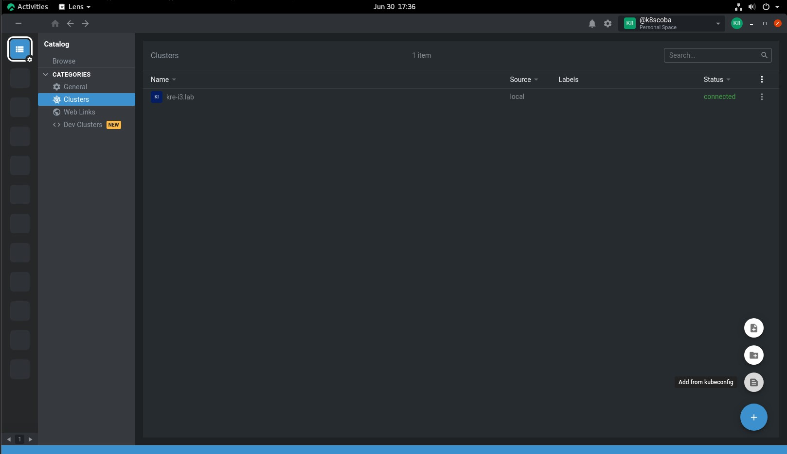
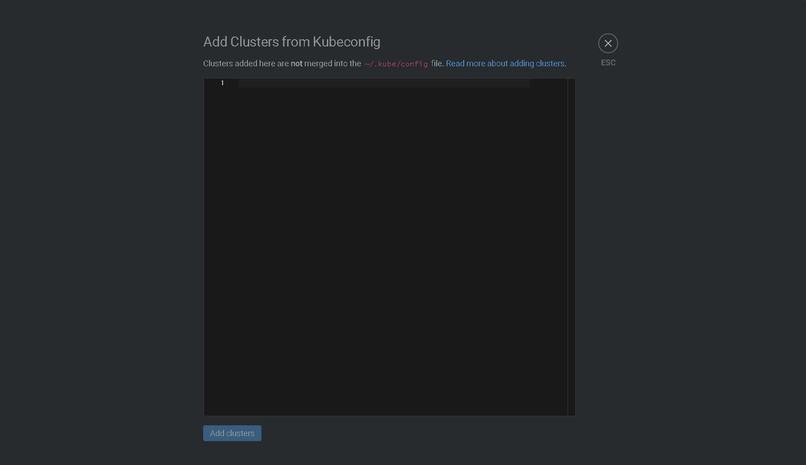
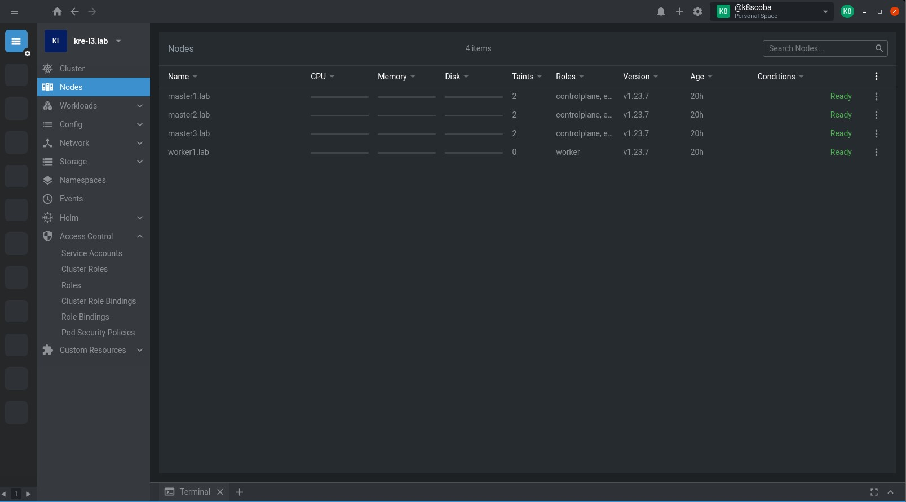

# Kubernetes Lens Dashboard i3 Tutorials
Documentation on How to use Lens


# This Tutorials based on Rocky,Centos, Red Hat

1. For K8s Dashboard, you can use and install Lens as Dashboard

```
Sign Up
https://app.k8slens.dev/signup

```
And then install it 
```
wget https://api.k8slens.dev/binaries/Lens-5.5.4-latest.20220609.2.x86_64.rpm
yum -y install libXScrnSaver
rpm -i Lens-5.5.4-latest.20220609.2.x86_64.rpm
```


2. Configure the Lens Dashboard, open it and login using your account you had create before :

After Login go to Cluster, in the right bottom you can see Add button ==> Add From kubeconfig




Get kubeconfig  and then copy paste it ==> Add clusters




Trallala you can see the dashboard and manage the RKE cluster using lens


